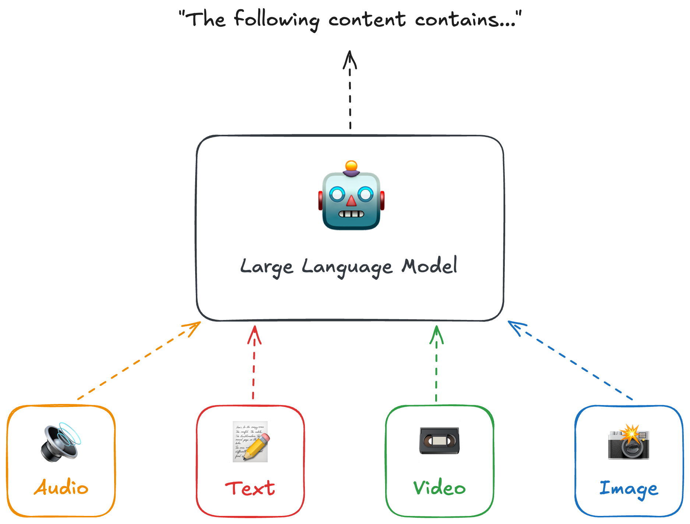
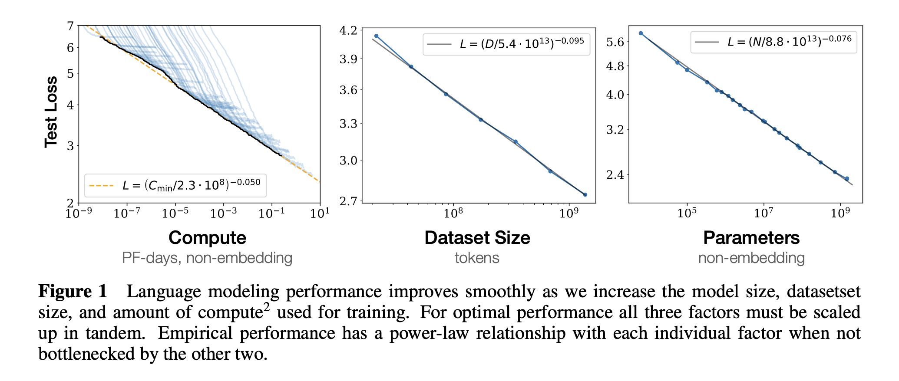
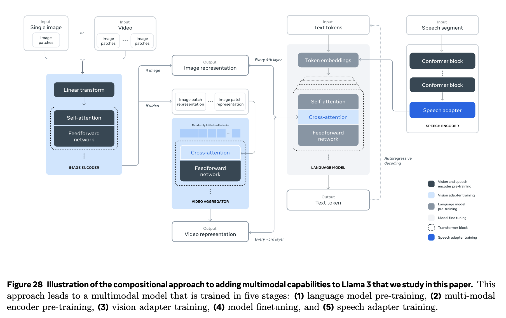

# How do *Language* Models Understand Images, Audio, and Video?

Language models began initially by, as the name suggests, modeling language using deep learning techniques. The most popular generative models, Large Language Models (LLMs), build on this capability of understanding language to create new content based on some form of input. Through (primarily) scaling the size of language models up, the ability to complete text based on an input has proven itself quite useful, leading to emergent reasoning, back-and-forth chatting, and advanced contextual understanding of text to near human abilities.

[*Scaling Laws for Neural Language Models*](https://arxiv.org/pdf/2001.08361)

While text understanding is incredibly useful, we live in a multi-dimensional world where understanding through text is just a portion of how we as humans process information. Within the digital realm, we still have visual and auditory understanding, taking the form of images (both photographs or even just your screen), videos, and sound (speech / non-speech). As large language models work towards emulating cognitive human behavior in a digital world researchers have been active in providing these additional modalities.

[*Llama 3 Technical Report*](https://arxiv.org/pdf/2407.21783)

This notebook will cover a high level overview of some of the techniques being used to teach language models image, video, and audio understanding with corresponding open source model examples.
